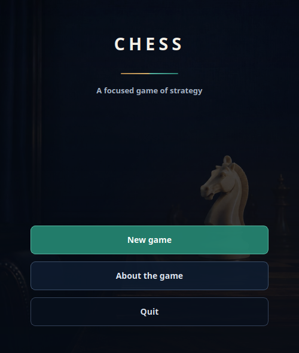
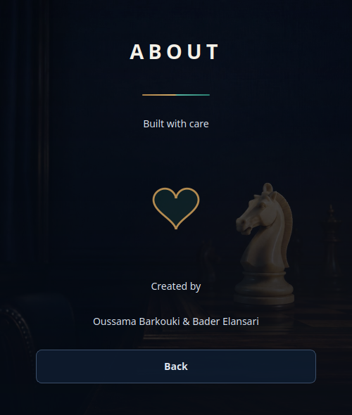
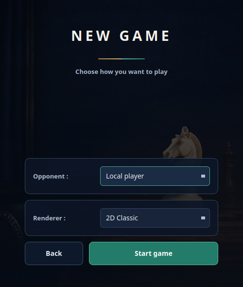
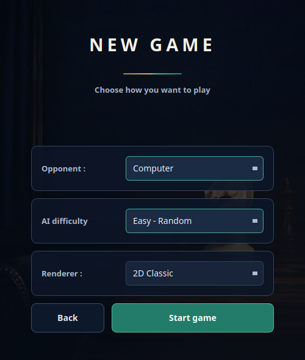
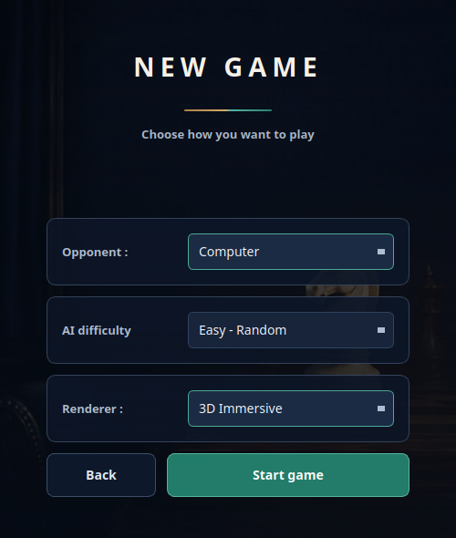
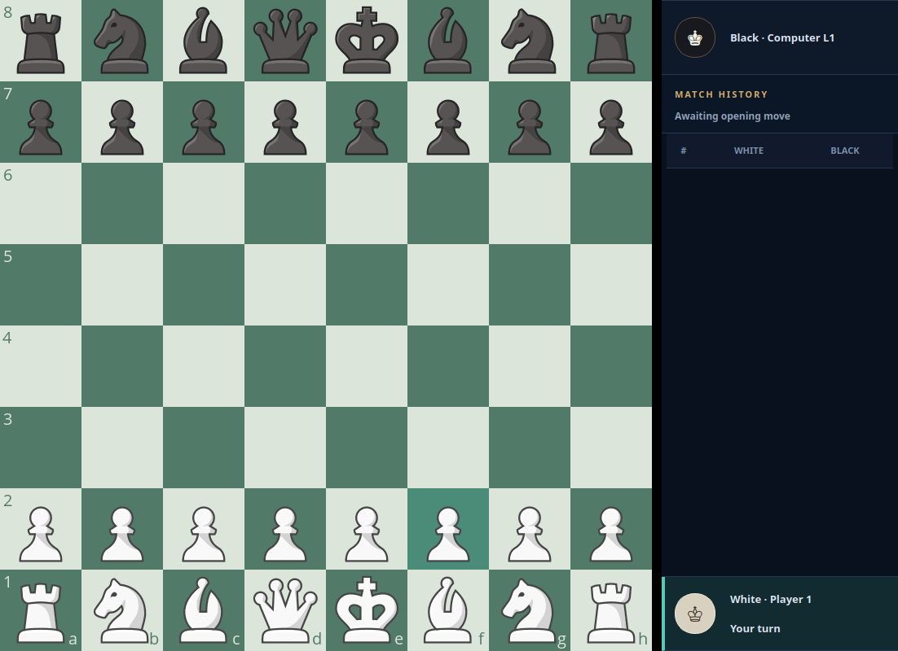
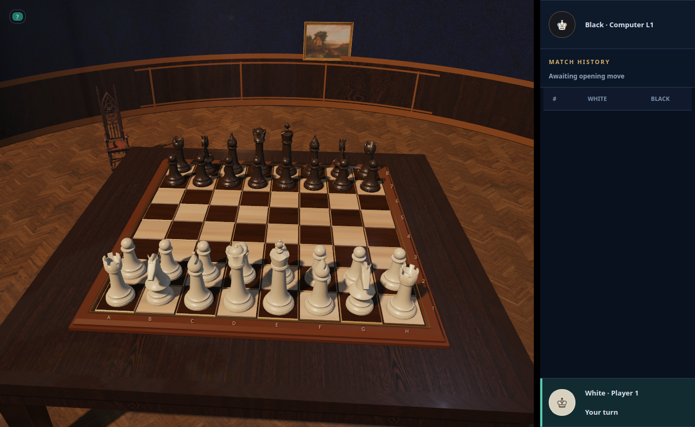

# Chess Game

A native C++17 chess game with a standalone rules engine, local multiplayer,
four computer difficulty levels, and two distinct front ends: a fast SDL 2D
board and an immersive OpenGL 3D salon.



## Highlights

- Legal-move validation with check, checkmate, stalemate, and castling support
- Local two-player matches or a computer opponent at four difficulty levels
- Random, greedy, and alpha-beta minimax computer strategies
- A drag-and-drop 2D board with move guides, feedback, and audio
- A fully modeled 3D room with regulation pieces, cinematic move and capture
  animation, positional guides, and orbit/zoom camera controls
- Cook-Torrance piece materials, image-based reflections, contact-hardening
  shadows, HDR rendering, bloom, and ACES tone mapping
- A companion match-center window with player status and move history
- A single-window Qt launcher with Back and Escape navigation
- Locally bundled visual and audio assets with no runtime network dependency

## Build and run

### Ubuntu dependencies

```bash
sudo apt update
sudo apt install cmake ninja-build g++ qtbase5-dev \
  libsdl2-dev libsdl2-image-dev libsdl2-ttf-dev \
  libglew-dev libglfw3-dev libglm-dev libgl1-mesa-dev \
  libimgui-dev libstb-dev catch2
```

Configure and compile a release build:

```bash
cmake -S . -B build -G Ninja -DCMAKE_BUILD_TYPE=Release
cmake --build build --parallel
```

The executable and its copied runtime assets are placed in `build/bin`. Run it
from that directory:

```bash
(cd build/bin && ./launcher)
```

On hybrid-GPU Linux systems, the launcher automatically requests the
high-performance NVIDIA or AMD GPU. Set `CHESS_DISABLE_GPU_OFFLOAD=1` before
launching to keep the system-default GPU instead.

## Tests

```bash
ctest --test-dir build --output-on-failure
```

The suite covers piece movement, board and game behavior, castling edge cases,
checkmate/stalemate detection, safe game copies, and renderer startup. Install
`xvfb` to enable the headless 2D/3D smoke test, or configure with
`-DBUILD_TESTING=OFF` when only the application is needed.

## Controls

| View | Controls |
| --- | --- |
| 2D | Left-drag a piece to its destination; close the board to return to the launcher. |
| 3D | Left-click a piece and destination; right-drag to orbit; scroll to zoom; use <kbd>W</kbd><kbd>A</kbd><kbd>S</kbd><kbd>D</kbd> to move the camera. |
| 3D | Press <kbd>R</kbd> to reset the camera, <kbd>F1</kbd> for visual settings and GPU/FPS details, or <kbd>Esc</kbd> to leave the match. |
| Launcher | Use the visible Back action or <kbd>Esc</kbd> to return to the home page. |

## Architecture

The project is split into separately compiled libraries:

- `src/game` contains the renderer-independent board, pieces, players, rules,
  and game-result logic.
- `src/ai` implements random, greedy, and minimax search levels with alpha-beta
  pruning and material/position evaluation.
- `src/renderers/2d` provides the SDL2 board and text rendering.
- `src/renderers/3d` contains the GLFW/OpenGL engine, scene, shaders, camera,
  materials, asset loading, selection, and animation systems.
- `src/renderers/common` shares SDL-powered move, capture, and error audio.
- `src/launcher` provides the Qt launcher, setup flow, match center, and renderer
  lifecycle.

## Screenshots

### Launcher

| Home | About |
| :---: | :---: |
|  |  |

### Game setup

| Local player · 2D | Computer · 2D | Computer · 3D |
| :---: | :---: | :---: |
|  |  |  |

### Gameplay

| 2D Classic | 3D Immersive |
| :---: | :---: |
|  |  |

## Third-party assets

The regulation chess meshes are derived from the CC0 **Chess board & pieces**
asset by OpenGameArt user KillGorack. The interior environment is Poly Haven's
CC0 **Combination Room**, and the tabletop uses Poly Haven's CC0 **Wood Table
001**. The physical salon also uses Poly Haven's CC0 **Wooden Chair 01**,
**Fancy Picture Frame 01**, and **Herringbone Parquet** assets.

Provenance, licenses, and conversion details are documented in:

- `assets/models/LICENSE.md`
- `assets/models/salon/LICENSE.md`
- `assets/textures/combination_room/LICENSE.md`
- `assets/textures/salon/LICENSE.md`
- `assets/textures/wood_table_001/LICENSE.md`

The launcher backdrop generation details are recorded in
`assets/ui/GENERATED_ASSET.md`. The scripts in `scripts/` reproducibly export
the regulation-piece and salon-prop geometry from their source scenes.

## License

The source code is available under the [MIT License](LICENSE).
